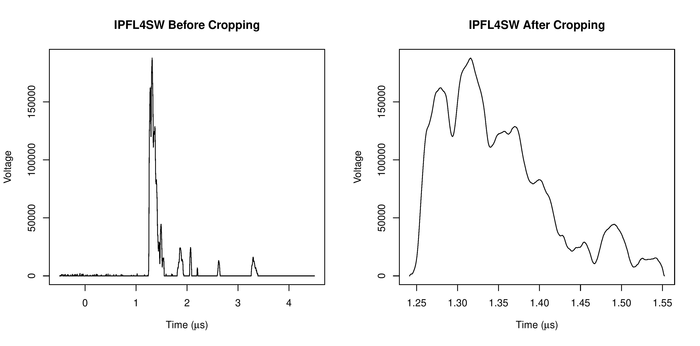

# R-Data-Analysis-Project
R scripts utilized for the analysis of flash x-ray  diagnostics data from the Nevada National Security Site (NNSS). With these scripts, I analyzed over 100 datasets each containing anywhere from 10,000 to 100,000 data points. You can find a small data sample under "data".

## Data_Plot
I used this to perfrom exploratory data analysis by simply plotting two quantitative varaiables. Then, I created PDFs files for each plot as per PI's request. Below is an example of the visualized data.

## Data_Smoothing
With this file, I applied the Savitzky-Golay Smoothing filter to our data; this was very helpful at removing all the excess noise from the signal. Additionally, I used a cropping technique to only analyze where the signal leaves the baseline.

